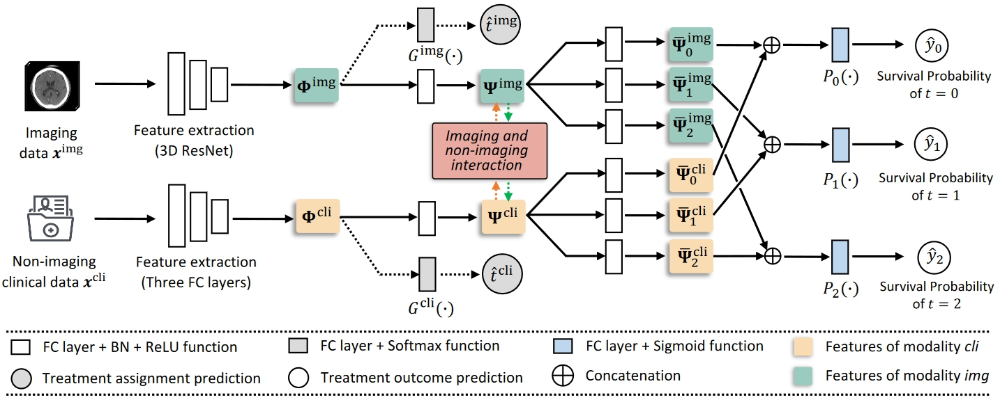
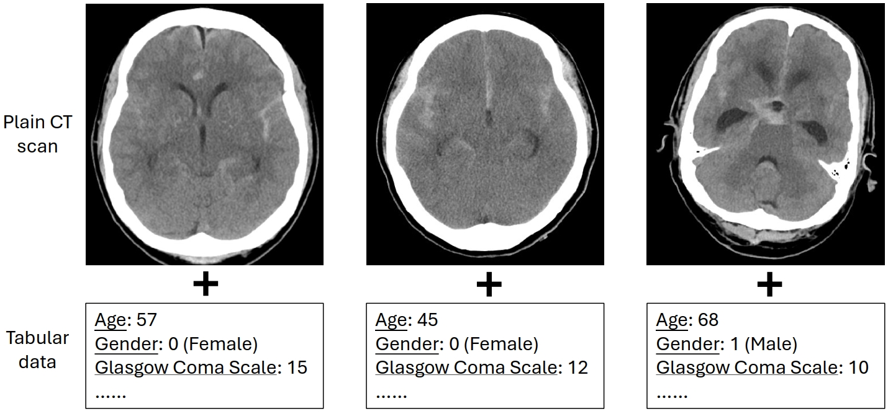
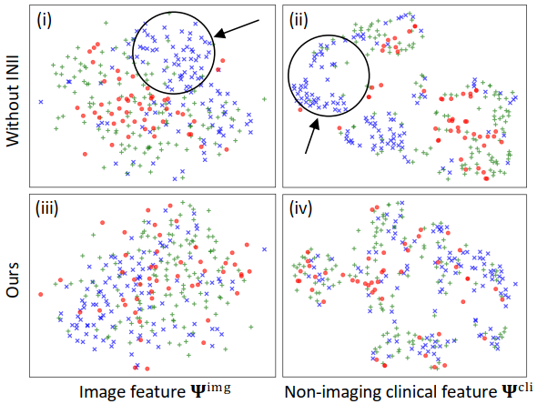

# Introduction

Pytorch implementation for paper **[Causal Effect Estimation on Imaging and Clinical
Data for Treatment Decision Support of
Aneurysmal Subarachnoid Hemorrhage]([https://github.com/med-air/TOP-aSAH](https://ieeexplore.ieee.org/abstract/document/10504783))**

<p align="center">

</p>

# Abstract
> Aneurysmal subarachnoid hemorrhage is a serious medical emergency of brain that has high mortality and poor prognosis. Treatment effect estimation is of high clinical significance to support the treatment decision-making for aneurysmal subarachnoid hemorrhage. However, most existing studies on treatment decision support of this disease are unable to simultaneously compare the potential outcomes of different treatments for a patient. Furthermore, these studies fail to harmoniously integrate the imaging data with non-imaging clinical data, both of which are significant in clinical scenarios. In this paper, the key challenges we address are: how to effectively estimate the treatment effect for aneurysmal subarachnoid hemorrhage; and how to utilize multi-modality data to perform this estimation. Specifically, we first propose a novel scheme that uses multi-modality confounders distillation architecture to predict the treatment outcome and treatment assignment simultaneously. Notably, with these distilled confounder features, we design an imaging and non-imaging interaction representation learning strategy to use the complementary information extracted from different modalities to balance the feature distribution of different treatment groups. 
We have conducted extensive experiments using a clinical dataset of 656 subarachnoid hemorrhage cases, which was collected from the Hospital Authority of Hong Kong. Our method shows consistent improvements on the evaluation metrics of treatment effect estimation, achieving state-of-the-art results over strong competitors.

# Setup

This model has been tested on the following systems:

+ Linux: Ubuntu 18.04

```bash
Package                Version
---------------------- -------------------
torch                  1.9.0
torchvision            0.10.0
h5py                   2.10.0
opencv-python          4.6.0
SimpleITK              2.1.1
scikit-image.          0.17.2
ml-collections         0.1.1
tensorboardx           2.2.0
medpy                  0.3.0
scikit-learn           0.24.2
pandas                 1.1.5
```

You can install packages using provided `environment.yaml`.

```shell
git clone https://github.com/med-air/TOP-aSAH
cd TOP-aSAH
conda env create -f environment.yaml
conda activate TOP_aSAH
```

# Data preparing
+ This article uses a private dataset. In order to successfully run the code, you need to prepare your own dataset.
+ Examples of multi-modality data inputs used in our study. We use plain CT scans as image data, and structured tabular data as non-imaging clinical data:
<p align="center">

</p>

+ Specifically, you need to prepare a .xls file, which saves the patients' non-imaging tabular data and the path of imaging data. We have provided an example for you to run the data, which is saved in "./data/SAH/example.xls".
+ Then you need to sort out the non-imaging tabular data (.xlsx) and the imaging data (.nii.gz) like this：

```bash
.
└── data
    └──SAH
        ├── imaging_data 
        │   ├── case 1.nii.gz
            ├── case 2.nii.gz
        │   └── ...
        └── example.xlsx
    └──...
```


# Training & Testing

+ We run main.py to train and test the model:
```bash 
python main.py
```
+ Our proposed model is saved in models.py, named "MultiRL".
+ This code will automatically partition the organized data, perform 10-fold cross validation, and automatically store the corresponding model files and evaluation results.
+ During the training phase, the code will conduct an evaluation every 10 epochs, and the results of the evaluation will be saved in the "results_save" folder.
+ The model is saved every 100 epochs, and the model files are stored in the "models_save" folder.
+ We use the policy risk, the absolute error in average treatment effect and the accuracy to evaluate our model. For more details, please refer to our paper or **[Estimating individual treatment effect: generalization bounds and algorithms](https://arxiv.org/abs/1606.03976)** 
+ The importance of each non-imaging clinical covariate is calculated based on **[permutation importance technique](https://www.jmlr.org/papers/volume20/18-760/18-760.pdf)**
+ You can run evaluation.py to calculate these metrics:
```bash 
python evaluation.py
```
+ Plot the t-SNE figure by:
```bash 
python plot_tsne.py
```
<p align="center">

</p>

# License
This project is covered under the **Apache 2.0 License**.

# Contact
For any questions, please contact 'wama@cse.cuhk.edu.hk'
